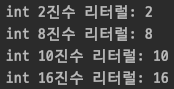
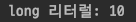
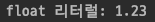
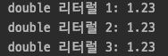
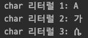
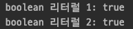
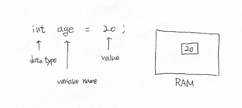
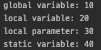

# Java Variable

변수란, 자바 애플리케이션이 실행되는 동안 값을 저장할 수 있는 메모리상의 공간이다.  
variable 은 "vary" 와 "able" 의 합성어로 값은 변할 수 있다는 것을 의미한다.  
- 변수에 저장된 값은 애플리케이션 런타임 중에 변경할 수 있다.
- 변수는 메모리상의 위치에 주어진 이름일 뿐이며, 해당 변수에 대한 모든 연산은 해당 메모리 위치에 영향을 미친다.
- 모든 변수들은 사용하기 전에 선언되어 있어야 한다.

## 데이터 타입

변수에 저장할 수 있는 데이터 유형이다.  

자바는 두 가지 유형의 데이터 타입이 존재한다.

### Primitive Type

|타입|설명|기본값|크기|값의 범위|
|----|----|-----|----|--------|
|boolean|true or false 값을 나타낸다.|false|VM 에 따라 다르다.|true, false|
|char|유니코드 문자|\u0000|16 bits|\u0000(0) to \uffff(65535)|
|byte|2의 보수인 정수|0|8 bits|-128 to 127|
|short|2의 보수인 정수|0|16 bits|-32,768 to 32,767|
|int|2의 보수인 정수|0|32 bits|-2,147,483,648 to 2,147,483,647|
|long|2의 보수인 정수|0|64 bits|-9,223,372,036,854,775,808 to 9,223,372,036,854,775,807|
|float|IEEE 754 부동소수점|0.0|32 bits||
|double|IEEE 754 부동소수점|0.0|64 bits||

#### Primitive Type 이 저장되는 영역은 어디일까?

JVM 메모리 안의 스택에 값이 저장된다.

#### 왜 char 형은 2바이트를 차지할까?

C 나 C++ 같은 언어에서는 오직 ASCII 코드 문자만을 사용하여 1바이트로 충분히 표현이 가능하다.    
반면에 자바에서는 ASCII 코드 기반이 아닌 유니코드 기반이어서 1바이트로는 안되기 때문에 2바이트를 차지한다.  
유니코드는 세계 각 국의 언어를 통일된 방법으로 표현할 수 있게 제안된 국제적인 코드 규약이다.

### Non-Primitive Type or Reference Type

Primitive Type 을 제외한 나머지가 여기에 속한다.  
예를 들면, Class, Interface, Enumeration, Array 등등이 있다.

#### Reference Type 이 저장되는 영역은 어디일까?

참조형의 실제 값(인스턴스)은 JVM 메모리 힙 영역에 저장되며 해당 주소를 스택에 저장한다.  

#### Reference Type 의 shallow copy 와 deep copy 에 대하여

참조형은 주소값을 저장하기 때문에 두 종류의 복사 개념이 존재한다.  
shallow copy(얕은 복사)는 주소값을 복사하는 것으로 복사한 변수도 동일한 주소를 가리키기 때문에 어느 한쪽에서 값을 수정하면 나머지 한 쪽에서도 수정된 값을 가리키게 된다.  
deep copy(깊은 복사)는 값이 동일한 인스턴스를 힙 영역에 복사하고 그 주소를 스택 영역에 저장하는 것으로 완전히 다른 변수가 되기 때문에 서로에게 영향을 주지 않는다.  

## Literal

리터럴은 실제로 저장되는 데이터 그 자체를 의미한다.  
타입마다 표현할 수 있는 방법도 다양하다.

```java
int binaryInt = 0b10;
int octalInt = 010;
int decimalInt = 10;
int hexadecimalInt = 0x10;
System.out.println("int 2진수 리터럴: " + binaryInt);
System.out.println("int 8진수 리터럴: " + octalInt);
System.out.println("int 10진수 리터럴: " + decimalInt);
System.out.println("int 16진수 리터럴: " + hexadecimalInt);
```


```java
long longLiteral = 10L;
System.out.println("long 리터럴: " + longLiteral);
```


```java
float floatLiteral = 1.23f;
System.out.println("float 리터럴: " + floatLiteral);
```


```java
double doubleLiteral = 1.23;
double doubleLiteral2 = 1.23d;
double doubleLiteral3 = 123e-2d;
System.out.println("double 리터럴 1: " + doubleLiteral);
System.out.println("double 리터럴 2: " + doubleLiteral2);
System.out.println("double 리터럴 3: " + doubleLiteral3);
```


```java
char charLiteral = 'A';
char charLiteral2 = '가';
char charLiteral3 = '\u1234';
System.out.println("char 리터럴 1: " + charLiteral);
System.out.println("char 리터럴 2: " + charLiteral2);
System.out.println("char 리터럴 3: " + charLiteral3);
```


```java
boolean booleanLiteral = true;
boolean booleanLiteral2 = 0 < 1;
System.out.println("boolean 리터럴 1: " + booleanLiteral);
System.out.println("boolean 리터럴 2: " + booleanLiteral2);
```


## 변수의 초기화



## 변수의 스코프와 라이프타임

변수들은 사용 가능한 범위를 가진다.  
그 범위를 변수의 스코프라고 한다.  
스코프는 globalScope 와 localScope 로 나뉜다.  

```java
public class VariableScopeStudy {

    public static void main(String[] args) {
        VariableScopeStudy vss = new VariableScopeStudy();
        vss.localBlock(30);
        System.out.println("static variable: " + VariableScopeStudy.staticVariable);
    }

    int globalVariable = 10;

    static int staticVariable = 40;

    private void localBlock(int localParameter) {
        int localVariable = 20;

        System.out.println("global variable: " + globalVariable);
        System.out.println("local variable: " + localVariable);
        System.out.println("local parameter: " + localParameter);
    }
}
```
위 코드를 실행하면 아래와 같은 결과를 얻을 수 있다.



클래스의 속성으로 선언된 변수 glovalVariable 의 스코프는 클래스 전역이다.  
globalVariable 같은 변수는 인스턴스가 생성될 때 생성되기 때문에 인스턴스 변수라고도 한다.  

매개변수로 선언된 localParameter 는 메서드 블럭 바깥에 존재하지만 선언부에 존재하기 때문에 스코프는 해당 메서드 블럭 안이다.  
메서드 블럭 안에서 선언된 localVariable 역시 스코프는 메서드 블럭 안이다.

main() 메서드 안에서 인스턴스 변수인 globalVariable 은 사용할 수 없다.  
main() 메서드는 static 메서드이 때문에 static 변수만 사용할 수 있다.  
static 으로 선언된 변수(staticVariable)는 JVM 메모리에 최초 저장되고 생성된 모든 인스턴스에서 공유한다.  
static 변수는 클래스 변수라고도 한다.  
클래스 변수는 클래스명.변수명 형태로 사용하는것을 권장한다.  

스택 영역에 생성된 변수의 라이프타임은 블럭에 의해 결정된다.  
블럭 내에서 선언된 변수는 블럭이 종료될 때 스택 영역에서 제거된다.  
인스턴스 변수: 해당 인스턴스가 생성되고 GC 에 의해 제거되기 전까지 남아있는다.  
클래스 변수: 프로그램이 시작될 때 생성되고 종료될 때까지 남아있는다.  
지역 변수: 해당 변수가 선언된 블럭이 시작되고 종료될 때까지 남아있는다.  

<hr>

#### References

> 웹 문서
> - [geeksforgeeks | Variables in Java](https://www.geeksforgeeks.org/variables-in-java/)
> - [geeksforgeeks | Data types in Java](https://www.geeksforgeeks.org/data-types-in-java/)
> - [자바 데이터 타입, 변수 그리고 배열](https://blog.naver.com/hsm622/222144931396)
> - [프로그래머스 | 변수의 scope와 static](https://programmers.co.kr/learn/courses/5/lessons/231)